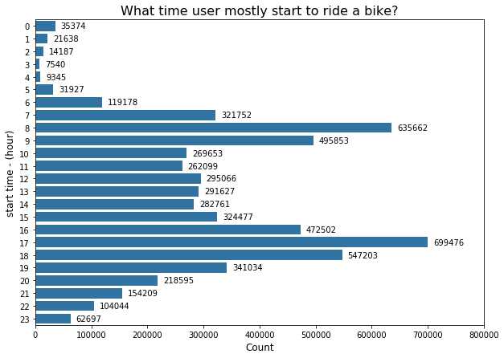
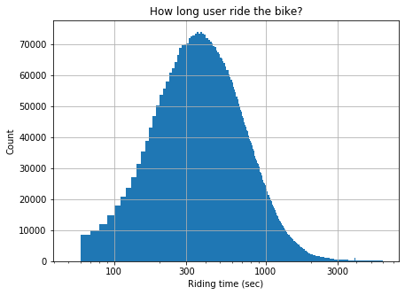
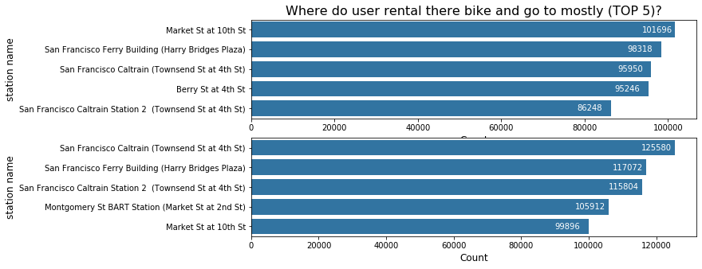
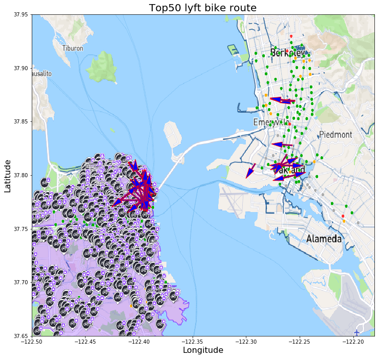
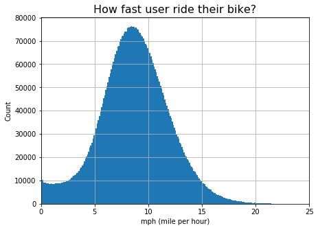

# Lyft Bay Wheel's trip dataset exploration.ipynb

## Overview
https://www.lyft.com/bikes/bay-wheels/system-data

This is bike sharing service operated by Lyft! We will look at the public data which the Lyft deployed and do exploratory and explanatory analysis! Every details is inside the following file! If you want to get a closer look go through this one!

- **Lyft Bay Wheel's trip dataset exploration.ipynb**

## Dataset

Lyft operate bike sharing service around bay area and collected the data related to this bike sharing service. This dataset is consisted with the `6,017,920` trip data about location, time, and which bike etc opened to the public. Every trip data is anonymized.

## Summary of exploration

I divided the steps to the following!
- Univariate Exploration 
- Bivariate Exploration 
- Multivariate Exploration 

### Univariate Exploration
> This is lyft bike trip data so `time` and `space` because our main interest is when and where of bike service! When the user use the bike at what time? We only did **univariate exploration** so cannot analyze in-depth but we could understand the distribution of variables related to `time` and `space`.

**When does the user mostly use the bike?**

We need to transform the **datetime** for each `month`, `day`, and `hour` to analyze this one.

- `February` has **714919** rides and its the the most bike travel among the months.
- `12th` has **214376** rides and its the the most bike travel among the days.
- `6pm` has **699476** rides and its the the most bike travel among the hours.

For `month` and `day` the user usage was not that different. It was interesting that user usage goes lower at `December` and reach the highest at `February`. We can think that maybe because of weather. If we want to go into details we could consider gathering addtional weather data to analyze this. In case of `day` it was close to **uniform distribution**.

Users mostly use bike `8-9 am & 5-6 pm`. We could assume that maybe the user of bike service are mostly an office worker who commutes by bike. So we know when the user start to use the bike. 

Then **how long they ride it?**

`Bike use time` was forming **normal distribution** in `log scale`. There were some outliers using the bike more than **10 days** but its pretty unusual. Most of the people were using bike less than **1 hour** and **6 minutes** usage was showing the highest proportion among all the usage time. Seems most of the users move by bike only for short distance and use car for more further distance.

Then **where are the users starting to ride the bike?**

We know they don't really need to use a long time.

- total `507` spot that bike was parked for both start station and end station.
- For `start station`, `Market St at 10th St` is the most popular station.
- For `end station`, `San Francisco Caltrain (Townsend St at 4th St)` is the most popular station.
- Start station top 10 and End station top 10 has 9 station the same. This means people mostly start to use bike from here and end here.

We can think that users are using **subway** or **train** and after that they use `bike` to reach the place they want to go! When we see this in details using `longitude` and `latitude` information we could see the followings.

- Most of the `station bike usage` is around **longitude** `-122.39`, `-122.28`, and `-121.88`
- Most of the `station bike usage` is around **latitude** `37.33` and `37.77`

We could think that this place are pointing at the lyft 3 service area.

**Lyft bike station**
- San Francisco
- East Bay
- San Jose

For each popular are the distribution for each spot is `left-skewed` in **longitude** and `bimodal` in **Latitude**. Maybe we could find popular `Public transportation` spot when we track this.

We could be curious about **how many bikes are used for the service?**

There is total **15996** bikes according to the dataset and when we check the `distribution of bike usage` using histogram, we can see it's `right-skewed`. Most of the bike was used less than 500 times.

> Gladly there were no odd or unusual distributions of the data were predictable and shown correct.

The **datetime** that was showing us the user bike `start time` and `end time` here were no data to be changed. In case of **datetime** we cannot use the data itself which was following the format `YYYY-MM-DD hh:mm:ss` so had to extract each `year`, `month`, `day`, and `hour`.

The **longitude** and **latitude** data includes wrong data. It shows the location where the service of lyft bike sharing operates is among the USA but actually this is not right. The service is limited to `California`.

**Lyft bike station**
- San Francisco
- East Bay
- San Jose

We could consider there is some noise inside the `longitude` and `latitude` data and removed the data that is outside the service area. Not quite sure why this wrong `longitude` and `latitude` was inside because didn't dive in deeper but can make assumptions that in the past the lyft service were held in other `province` but was withdrawed or it was just a mistake of the backend server. 

**is_equity** column has ambiguous meaning and searched for it but didn't find it. So I simply dropped this column. Also this column had **138251 rows** of data so it doesn't had a valuable number of data neither.

### Bivariate Exploration

> I could get more insights compared to univariate exploration at here. I could dive deep so could get user bike usage preferance related to `datetime`, `location`, `bike usage time`. **Relationships of bike, time, and space** allow me to understand more in-depth showing me `user use a bike at specific time at specific location`, `user's bike route`, `top10 bike's location` and more etc.

> **Our main feature of interest is `time` and `space`.** By combining `bike start hour` with `bike usage time` we could see the user always use bike around **6 minutes**, and when we combine `bike start hour` with `bike start day` we could see the **11-12th 8am and 5pm** is the most usage date. **Even it is a same feature depending on what other feature it combines it gives different stories and insights**.

It was interesting time to get more in-depth insights by the relationships of the variables!

**`datetime` vs `bike usage time`**

--------
By looking at the relationship with `datetime` and `bike usage time` I found that there were only 2 times of bike ride who **ride more than 10 hours!** One record was approximately `250 hours` at **4pm** and other was `225 hours` at **11pm**. Both are near `10 days ride`! Extraordinary! And `0.3%` ride more than `3 hours`!

I thought `bike usage time distribution` for each `bike start hour` distribution was going to show me different shapes! Different from expectation the distribution showed **normal distribution** in log scale for all hours. The expectation was that the peak(mean) of normal distribution might vary a lot depending on the `hour` but it was wrong. Still most of the user use the bike for **6 minutes** no matter what time is it. Quite interesting! What is the meaning of **6 mintues?** Can't tell! No more informations to guess here!

**`datetime` vs `datetime`**

--------
I made relationships inside the `datetime`! The datetime have four features, `year`, `month`, `day`, and `hour`. The results I got was not different as what I got from `univariate exploration!`.  **February** and **8am & 5pm** was the hotest datetime for the bike usage!

But one thing that looked interesting cameout! `month` vs `day` heatmap shows `diagonal pattern` of the bike usage frequency. **Why people's `the most bike usage days` does not stuck in one days like 11-12th and move to backward like `moving window`** as month goes? That was weird.

**`datetime` vs `location`**

--------
Now I moved to relationship between `datetime` and `location`! We know that **February** and **8am & 5pm** is the hotest datetime and where people are using bike at this moments! I explored this with the `bike station` with `hour`!

- People start to use bike near **public transportation** at `8am` more than `5pm`
- People end the use of bike near **public transportation** at `5pm` more than `8am`

`Berry St at 4th St` acts opposite with the above explanation. If we dive more deep this kind of `station` will came our more. We can make assumption that people using `caltrain` is coming from other area to work and people who lives at `San Francisco` go to work using bike near `Berry St at 4th St`. Well **the point is many people are using bike as the next tool to move after the `public transportation` or to go to the there**.

**`location` vs `location`**

--------
Now we could get curiosity of the users route using bike. By looking at the relationship between `location` and `location` we could get informations of these! By grouping up with **start and end station** we could find which route is the most popular route! 

- `San Francisco Ferry Building (Harry Bridges Plaza)` to `The Embarcadero at Sansome St`
- 16313 times used

Trend of route but seems hard to get intuitive understanding with just names. We need a map that shows the route for precise understanding! Even I limited the number of station to `top10` it seems messy! One thing I found interesting is users end using the bike where they rental it! It means they are not using bike to move to somewhere. Rather they are using bike for wandering around for travel.

Then we could think about what station is the most popular one to comeback after riding?

- Total **504** station are used like this!
- `The Embarcadero at Sansome St` is the popular one recording `5071` times!

**Then how long they ride for this purpose? Just to look around and comeback?**

- **98.2%** of users ride less than `5 minutes`
- Other **1.8%** users ride more than `5 minutes` doesn't exceed **`25 minutes`**

**`bike` vs `location`**

-----
I also looked at the relationship between the bike and the location! I compared the `top10 the most used bikes` with the `location` to find out where is the bike located at?

**The 10 most popular bike's location** were the places that is known **most popular stations of lyft bike service**. The **public transportation**. This is not surprising results. I was hoping to find some interesting results but came out ordinary.

> There aren't a lot of variables that is not the main feature of interest. It is `user_type`, `bike_share_for_all_trip`, `rental_access_method`, `rideable_type`, and `is_equity`. We could spend more time on these but seems the data is not complete at all except `user_type` and didn't planed to expand to this **service details** I only compared one relationship!

**`user type` vs `bike share for all trip`**

-----
- These `2 variables` are **the most filled ones** among the `5 variables`!

`Bike share for all trip` is a annual plan for **Bay Area residents**. So its not surprising that people who is just a `customer`(who is not a subscriber) doesn't have `bike share for all trip` plan. And even for subscriber only `9.86%` are using the `bike share for all trip` plan. Considering the benefits it's not high. There could be reason why people don't subscribe to this wonderful plan. Maybe they didn't need that much ride or just decided to ride a car rather bike. If we could gather more data maybe we could answer this.

**Further exploration could be done between `5 service details variable` vs `time`, `location`, `bike`. I'm not going to do here but will be left for someday.**

### Multivariate Exploration

> Looking at relationships with more variables strengthen a lot for analysis because we could look more in-depth compared to bivariate! We could start to look whatever we want to look at! We could trace the route at map, or look more steps from what we were looking at bivariate exploration! Before it was general exploration, from here we could dive into the details and reveal the real worlds truth!

**`Correlation` between variables**

--------
A formal exploration! There aren't special things to look at here. Just checked it. Results will came out will be predictable. I stopped doing further calculation because the data size for each variable is more than **6,000,000** so took a long(Really long) time time calculate.

- `start_time` vs `end_time` Highly correlated
- `start_station_longitude` vs `end_station_longitude` Highly correlated
- `start_station_latitude` vs `end_station_latitude` Highly correlated

**`longitude` vs `latitude`**

--------
This use **4 numeric variables**. By this I could show the user's route visually at the map! So we could check where the user ride the bike. 

- `Top50 route` is focused on the **San Francisco near bay**
- **East bay** have approximately **9 route** for `Top50`
- **San Jose** has only **1 route** that get inside `Top50`

Map `longitude` and `latitude` is not precisely match so we might not be sure about the route shown on the map but we could get glimpse of where the user mostly use the bike!

**`bike` vs `location` vs `bike usage time`**

--------
This is showing the relationship between the `bike`, `location`, and `bike usage time`! When we compare the `bike` and `location` we could see that the `San Francisco Ferry Building (Harry Bridges Plaza)` has the most usage with bike **2692**. But **how long did the user used the bike**? We combined `duration_sec` and could get the answer.

- `San Francisco Ferry Building (Harry Bridges Plaza)` bike riders ride around **10-40 minutes**
- `The Embarcadero at Sansome St` bike **1161** has a record that run more than **80 minutes**
- Average bike usage time is all below **40 minutes**

When we consider most of the user ride bike for **6 minutes** and the bike usage distribution was at the edge around **1 hour** we could know that the `location` and `bike` is not the one belongs to the group of **6 minutes** ride ones that is mostly dominating the usage time. It means the most usage time **6 minutes** is not coming from the `top10` **bike** and **location**, its coming from other.

Besides your trying to ride a bike for traveling around it's hard to say you need to ride bike for a long time. We could get curious. We saw how long they ride. So how about **how fast they ride** and **how long distance they ride?**

**`start hour` vs `distance` vs `duration hour`**

--------

**People who comeback to the place where they started to ride the bike is removed!**

- The speed of bike remains same till `24 minutes` and start to slow down as time go by. People are getting tired.
- Normally, people ride around `30 minutes` goes the furthest.
    - The `distance` user gone goes decreases after `30 minutes`
- There are outliers who ride the bike nearly **40 mph**
- Interestingly lots of people almost didn't moved from where they ride the regardless of bike using time.
    - Maybe they might ride and had to comeback but return to the nearby station they origianlly rental.

I looked at the **speed** more closely with **mph**.

- The histogram shape of **mph** is `normal distribution` but looks `bimodal` at the very left side!
- **14.56** mph is the average speed for bike users
- Most users speed doesn't go over `22 mph`
- 
> Most of the results are predictable and reasonable. So hard to say there are surprising interactions! One thing that seems interesing was there are actually a lot of people who just ride the bike and nearly didn't move a lot!

## Key Insights for Presentation

For the presentation, I focused on finding the user behavior pattern! So I start from when the user start to use the bike to how fast user ride the bike! The flow is focused on understanding `time` and `space` related features! Here is some insights!

### What time user mostly start to ride a bike?

Users mostly use bike 8-9 am & 5-6 pm. We could assume that maybe the user of bike service are mostly an office worker who commutes by bike. Or this could be a people who is traveling! Now let's look at how long user ride a bike!

### How long user ride the bike?

Distribution is left-skewed and unimodal. In the log scale if we only consider duration second between 50 and 6000 sec we can see that the graph is showing normal distribution and most of the people used bike for 370 second, approximately 6 minutes! Isn't quite interesting that user ride so little? Now we now when and how long user ride a bike! Then where does user ride the bike?

### Where do user rental there bike and go to mostly (TOP 5)?

For rental, `Market St at 10th St` is the most popular station. For destination, `San Francisco Caltrain (Townsend St at 4th St)` is the most popular station. We know that 8am and 5pm is the most popular usage time and now we know the most popular station. So what station people are using at 8am and 5pm? Will it be the same station that came out here?

### What is the user bike trip route?

- `Top50 route` is focused on the **San Francisco near bay**
- **East bay** have approximately **9 route** for `Top50`
- **San Jose** has only **1 route** that get inside `Top50`
- **San Francisco near bay** is place for travel. Maybe most users are using the bike not for commuting rather traveling.

Map `longitude` and `latitude` is not precisely match so we might not be sure about the route shown on the map but we could get glimpse of where the user mostly use the bike! We can see the places how user move! In the next slide there will be image of the **San Francisco** area where the most popular route is located!

### How fast user ride their bike?

The histogram shape of **mph** is `normal distribution` but looks `bimodal` at the very left side! **14.56** mph is the average speed for bike users and most users speed doesn't go over `22 mph`! Interestingly there are users who doens't move at all! Maybe they might ride and had to comeback but return to the nearby station they origianlly rental. 

